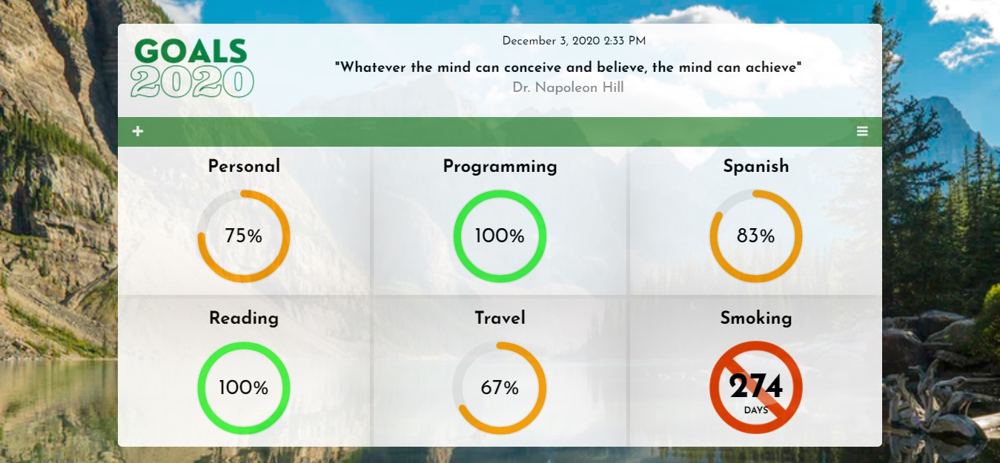
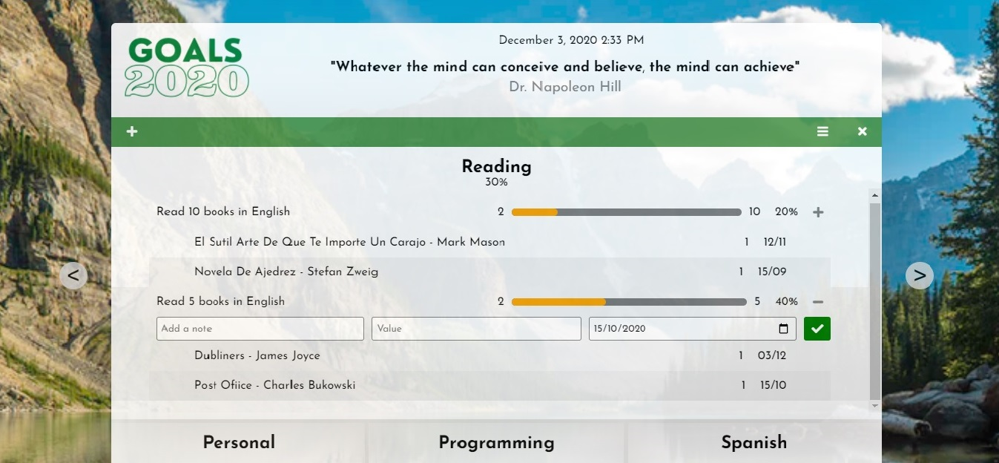

# Goal Tracker

A simple site to keep track of your goals year to year.

## Features

-   Set goal categories with sub-goals based on what you plan to acomplish this year.
-   Progress wheel for each goal that update based on completion of subgoals.
-   Set subgoals with targets - Overall goal percentage increases with target item additions to see your achievements in real time.
-   Auto-generated motivational quote on page load (npm "inspirational-quotes").
-   Made with vanilla JS and a fully responsive CSS grid.
-   Save to localStorage.

## How To Run

-   npm run start - Run development mode
-   npm build - Build production version
